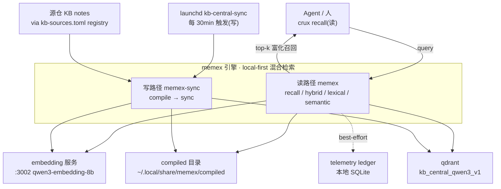

# memex 架构

> 给新读者的一页地图:memex 是什么、读/写两条路径由哪些模块拼成、改某类东西去哪个文件。
> 本篇讲现状(引擎现在长什么样、去哪改)。逐条 CLI 用法见 `memex --help` / `memex-sync --help`。

## 1. 鸟瞰

memex 是一个 **local-first 的 KB 混合检索引擎**:把散在各源仓的知识 note 编译进一个中央
qdrant collection,对外给一条「最佳召回」。它纯 Python 实现(≥3.12),对外两个 console
script:`memex`(读)、`memex-sync`(写)。

引擎分**两条路径**:

- **读路径**:query → 三 lane(lexical BM25 / semantic 向量 / hybrid 加权 RRF)→ recall(锁定生产最佳配置)。读入口是 `memex`(`cli.py`)。
- **写路径**:源仓 note → 编译 `kb-note-v1` → sync 进中央 collection。入口是 `memex-sync`(`indexing/cli.py`)。

两路由一个 **flag `read_from_central`**(默认 True)汇合:读路径据它决定从中央 compiled/collection
读、还是从 legacy `.legacy-index` artifact + per-root collection 读(用于从旧索引产物迁移)。

### 鸟瞰图(System Context · C4 L1)

> **Viewpoint**: System Context——把 memex 引擎当一个系统,画它与外部 actor(agent/人、launchd)、数据源(源仓 notes)、依赖服务(embedding/qdrant)、本地产物(compiled/telemetry)的边界与数据流。读/写两路径在引擎内,经 `read_from_central` flag 汇合。
> **真相源 & correspondence**: 节点对应下文 §2 模块地图,源指针见 frontmatter `code:`;图从模块关系投影,非独立真相。

## 2. 模块地图 codemap

源码在 `src/memex/`。读路径在顶层,写路径在 `indexing/` 子包。

### 读路径

| 模块 | 职责 | 关键符号 |
|---|---|---|
| `cli.py` | `memex` 入口:`query`(低层调参/单 lane)/ `recall`(对外唯一最佳召回)/ `stats`;telemetry 包裹 | `query`、`recall`、`run`、`_engine_for` |
| `recall.py` | canonical recall 引擎层:hybrid + protection + title/path 富化(LLM 友好) | `recall`、`RecallHit`、`_resolve_engine`、`_doc_lookup` |
| `facets.py` | facet 收窄统一口径(domain 前缀/kind/tag):归一一处,qdrant must 与 lexical mask 同源 | `Facets`、`qdrant_must`、`matches_doc` |
| `hybrid.py` | weighted-RRF 融合(lexical + semantic)+ planner trace | `HybridEngine`、`_rrf`、`_weights`、`plan` |
| `engine.py` | 多仓 lexical 引擎:registry/compiled → per-repo 索引 → 跨仓合并 | `Engine` |
| `lexical.py` | per-repo 4 字段加权 BM25(title5/body1/object_key2/path2) | `RepoIndex`、`Hit`、`FIELD_BOOST` |
| `semantic.py` | semantic lane:调外部 embedding 服务 + qdrant;含中央/per-root 双路检索 | `SemanticEngine`、`search_central`、`search_collection`、`embed_texts` |
| `planner.py` | 确定性本地 query 分类(中文低锚 / 强锚定) | `is_zh_low_anchor`、`is_strongly_anchored`、`code_token_count` |
| `tokenize.py` | jieba 自然语言分词 + slug 切分(BM25 用) | `tokenize`、`slugify` |
| `artifacts.py` | legacy `.legacy-index` artifact loader(flag off 时 lexical 读源) | `load_artifacts`、`Doc`、`INDEX_PROFILE` |
| `compiled.py` | compiled 目录(`kb-note-v1`)的 lexical 投影(flag on 时 lexical 读源) | `load_compiled_corpus`、`load_compiled_docs` |

### 写路径(`indexing/` 子包)

| 模块 | 职责 | 关键符号 |
|---|---|---|
| `indexing/cli.py` | `memex-sync` 入口:`compile` / `sync` / `sync-all`(orchestrator);退出码 0/1/2/3 | `compile_cmd`、`sync_cmd`、`sync_all_cmd`、`_resolve_repos` |
| `indexing/scan.py` | 扫源仓 + domain 派生(INDEX 节点链)+ identity 派生 + 域守卫 | `discover_domains`、`scan_notes`、`derive_identity`、`repo_name`、`ScanError` |
| `indexing/integrity.py` | compile 内容完整性发现(ZERO_DOC / DOMAIN_SKIP)→ 结构化告警 + 退出码 3 | `findings_for_report`、`IntegrityReport`、`IntegrityFinding` |
| `indexing/compile.py` | note → compiled doc(可索引性闸门 / kind enum / source_hash / commit_time) | `compile_note`、`CompiledDoc`、`embed_text`、`write_compiled`、`KINDS` |
| `indexing/pipeline.py` | 单仓编排:扫描 + 编译 + 报告(+ 落盘 persist) | `compile_repo`、`CompileOutput`、`persist` |
| `indexing/sync.py` | qdrant 写 sync:两级 reuse + unit-mode 断言 + prune 三守卫 + payload | `sync_repo`、`point_id`、`build_payload`、`ensure_collection`、`SyncReport` |
| `indexing/qdrant.py` | qdrant 写侧 client(纯 stdlib http;collection/points CRUD) | `Qdrant`、`QdrantError` |
| `indexing/frontmatter.py` | frontmatter 解析(可索引性闸门) | `parse_frontmatter`、`split_frontmatter`、`FrontmatterError` |
| `indexing/report.py` | 单仓编译报告(覆盖率 diff / loud-skip / kind 降级 / 域树) | `RepoReport`、`SkipEntry`、`KindDowngrade` |

### 横切

| 模块 | 职责 | 关键符号 |
|---|---|---|
| `registry.py` | 源仓清单(真相在外部 `kb-sources.toml`,fail-safe 降级内置)+ per-root collection 命名 | `load_source_registry`、`active_sources`、`Source`、`collection_for` |
| `config.py` | 应用配置(env > .env > 默认):flag / 中央 collection / 外部服务 URL / 超时 | `Settings`、`settings` |
| `telemetry.py` | 每次 `memex` 调用落本地 SQLite ledger + `stats` 汇总 | `run_instrumented`、`stats` |
| `logging_setup.py` | structlog 配置 | `setup_logging` |

入口装在 console script `memex`(`cli:run`)、`memex-sync`(`indexing.cli:run`)(`pyproject [project.scripts]`)。

## 3. 读路径:三 lane + recall

- **lexical**(`Engine` → `RepoIndex`):per-repo 4 字段加权 BM25(`FIELD_BOOST` = title5/body1/object_key2/path2),每字段独立 BM25 加权求和(**不是** cross-field BM25F)。`object_key`/`path` 走 slug 切分,其余走 jieba。跨仓时各仓取 top-k 后按原始 BM25 分合并(简单合并,非跨仓校准)。默认**不按 object_type 过滤**(类型降为 prior,不再是硬闸)。
- **semantic**(`SemanticEngine`):调外部 embedding 服务(可配 model / URL,**无 query instruct 前缀**)+ qdrant named vector `object`、Cosine。`read_from_central` on 走 `search_central`(中央 collection,filter `point_kind=note`/`index_profile`,object_key=payload.identity,repo 收窄 = identity 前缀客户端过滤);off 走 `search_collection`(per-root)。多取一档深度按 object_key 去重再返回 top-k unique(防 chunk 点挤掉 unique 对象)。
- **hybrid**(`HybridEngine`):weighted-RRF。`RRF_K=60`,贡献 = weight/(RRF_K+rank);lexical_weight 恒 1.0;semantic_weight = 2.0 当 query 为中文低锚(`is_zh_low_anchor`),否则 1.0;中文低锚 semantic 候选 depth cap 320。protection on 时强锚定 query(`is_strongly_anchored`,代码符号 token ≥2)抬 lexical_weight 到 2.0。
- **recall**(`recall.py`):对外唯一最佳召回 = hybrid + lexical-dependent protection(生产默认)+ title/path 富化。`_doc_lookup` 据 flag 从 compiled 目录或 `.legacy-index` artifact 取 title/path 补全 hit。
- **facet 收窄**(`facets.py`):recall 的 `--domain`(前缀语义,靠写路径 domain_prefixes 累进数组 `a/b`→`["a","a/b"]` 做精确 match)/`--kind`/`--tag`(keywords)。归一(strip 尾斜杠/空白)只在 `Facets.__post_init__` 一处,semantic(qdrant server-side must,`qdrant_must`)与 lexical(全量打分后 mask,`matches_doc`,不 underfill)消费同一实例 → 两 lane 口径结构上不可能分叉。facet 需要中央读路径(legacy artifact 无 facet 字段,大声 ValueError);不收窄时不传 kwarg,默认路径与旧行为逐字节一致。repo 不是 facet,`--repo` 走 identity 前缀客户端过滤兜底。

planner(`planner.py`)做确定性 query 语言分类:中文低锚 = 有 CJK 且无 ascii-identifier token;强锚定 = 代码符号 token(含数字/`_`/`:`/`-`、camelCase、ALL_CAPS)≥ 阈值。

## 4. 写路径:编译 → sync(indexing 子包)

一条 note 进中央 collection:

1. **扫描 + 派生**(`scan.py`):`discover_domains` 找所有 `INDEX.md` → 域 = INDEX 节点链(跳过非域物理目录);`scan_notes` 给每篇算 `identity = <repo>:<domain>:<slug>`(slug = note 相对其域目录的路径)。域树撞键 / identity NFC+casefold 撞键 → `ScanError` loud 拒绝。
2. **编译**(`compile.py`):可索引性闸门——有 frontmatter ⟺ 可索引,无则 loud-skip(进报告);kind 超出 `KINDS` enum 降级为 note 并记录。产出 `CompiledDoc`(schema `kb-note-v1`):identity/domain/domain_prefixes/title/description/keywords/kind/body_text/source_path/source_hash/compiled_hash/commit_time。`embed_text` = description+keywords+body(**不含 title**:title 无 H1 时回退文件名,改名不该破 re-key 触发重新 embed)。
3. **编排**(`pipeline.py`):`compile_repo` 单仓扫+编+报告;`persist` 落 compiled JSON 到 `<compiled_dir>/<repo>/`(中央数据目录,源仓零污染)。
4. **sync**(`sync.py`):`sync_repo` 逐篇决策——① point_id 命中且 text_hash 同 → 只补 payload / skip;② point_id miss 但 (text_hash, embedding_profile) 现存 → 复用向量 re-key(零 embed);③ 都 miss → embed + upsert。再 prune diff。默认 dry-run,`--apply` 才动 qdrant。

入口 `memex-sync`(`indexing/cli.py`):`compile`(只编译落盘)、`sync`(单/指定仓)、`sync-all`(orchestrator 遍历 registry 串行,单仓崩溃不中断全批)。退出码 **0 全绿 / 1 硬失败 / 2 prune 守卫拒绝(需人工 `--force`)/ 3 内容完整性发现**(0-doc 仓 / 域内静默 skip;仅在无 1/2 时,供日审 cadence 检测告警,见 `indexing/integrity.py`)。

## 5. registry / config

- **registry**(`registry.py`):源仓清单真相在外部 `kb-sources.toml`,memex 用 stdlib `tomllib` 读同一份(`$KB_SOURCES` 覆盖路径,`$KB_WORKSPACE_ROOT` 覆盖 workspace 根)。读路径 fail-safe:缺失/损坏/重复 name/非法 name → 降级内置 `DEFAULT_SOURCE_REPOS` 或跳过该条 + warning。`active_sources` 只返回真有 artifacts 的仓。
- **config**(`config.py`):`Settings`(pydantic-settings,env 前缀 `KB_SEARCH_`,可 `.env`)。关键项:`read_from_central`(默认 True)、`central_collection`、`compiled_dir`、`embedding_url`/`embedding_model`/`embedding_dimensions`、`embed_timeout_secs`、`qdrant_timeout_secs`、`lexical_dependent_protection`(默认 True)。

## 6. 核心不变量与边界

1. **`read_from_central` 默认中央**(`config.py`,默认 True):读路径默认从中央 compiled/collection 读;翻它影响 lexical 读源(compiled vs `.legacy-index` artifact)与 semantic 检索目标(中央 vs per-root)。改默认是 cutover 级动作。
2. **profile 常量读写同源**:`index_profile`、`point_kind=note`、`embedding_profile` 由读侧 `semantic.py` 定义,写侧 `indexing/sync.py` import 同一份。破坏后果:读写 filter 口径漂移,写进去的点读不出来。
3. **prune 三守卫**(`sync.py`):① per-repo 收窄(identity 前缀,绝不跨仓判删);② 单仓待删 >50% → 拒绝,显式 `--force` 才放行;③ 默认 dry-run,`--apply` 才动。破坏后果:误删整仓 / 跨仓误删。
4. **point_id 含 unit-mode**(`sync.py`):`point_id = uuid5(固定 namespace, identity + ":" + unit-mode)`。`POINT_NAMESPACE` 由稳定字面量派生,改它 = 全库 re-key,禁动;collection 内 mode 必须一致(`_assert_unit_mode`),切 chunk = 显式整库重建,禁增量混跑。
5. **embed 超时设长防队列雪崩**(`config.py` `embed_timeout_secs`):单线程 embedding 服务端首建慢,客户端短超时会遗弃请求、服务端继续磨被弃请求 → 队列雪崩。长超时等待远比制造遗弃便宜。
6. **可索引性闸门**:有 frontmatter ⟺ 可索引,无 → loud-skip(进报告,不静默)。compiled doc 损坏单文件 skip 不拖垮整仓。
7. **identity 位置派生**:identity = `<repo>:<domain>:<slug>`,文件移动/改域层级 = identity 变(删旧建新),无 uuid、无手写 key;worktree 下 identity 前缀由 registry 逻辑名(`name` 入参)固定、不取物理目录名(ADR-035,`pipeline.py` `repo = name`);旧 `scan.py:repo_name()` helper 现无调用点(勿当主路径)。
8. **不复用 legacy per-root collection**:写路径只操作中央 `central_collection`(全新 collection),`Qdrant` client 绝不触碰 legacy per-root 产物。
9. **telemetry 不影响命令**:`memex` 每次调用 best-effort 落 ledger,不改命令退出码(`$KB_SEARCH_TELEMETRY_OFF`/`DO_NOT_TRACK` 关闭)。

## 7. 关键流程

### 一条 `memex recall "中文低锚 query"`

1. `cli.recall` → `recall.recall(text, lane="hybrid")`。
2. `_resolve_engine("hybrid")` → `HybridEngine()`(默认从 `settings` 取 protection on)。
3. `HybridEngine.search`:planner 判中文低锚 → semantic_weight=2.0、depth cap 320;lexical 取 top-320(`Engine` 据 flag 读 compiled 或 artifact)、semantic embed query 后查中央 collection;weighted-RRF 融合排序取 top-k。
4. `_doc_lookup` 据 `read_from_central` 从 compiled 目录(或 `.legacy-index`)取 title/path 富化每个 hit → `RecallHit`。

读流程无 qdrant 写 / 无 prune 副作用。

### 一轮 `memex-sync sync-all --apply`

1. `sync_all_cmd` 读 registry(降级则 WARN),遍历各源仓串行 `sync_repo`,单仓崩溃记录继续。
2. 每仓:`compile_repo`(扫+编+报告)→ qdrant `ensure_collection`(不存在则建中央 collection + payload index)→ `_assert_unit_mode` 断言 → 逐篇两级 reuse 决策 → prune diff 三守卫 → 写阶段(set_payload / re-key upsert / embed+upsert / delete prune)→ `persist` 落 compiled。
3. 汇总各仓 summary + 失败清单 + 需 `--force` 清单 + 内容完整性 section;有硬失败 exit 1,否则有 prune 拒绝 exit 2,否则有完整性发现 exit 3。

## 8. 改 X 去哪

| 我想改 / 加 … | 从这里入手 | 备注 |
|---|---|---|
| 加检索 facet / 改 payload 字段 | `indexing/sync.py`(`build_payload` + `PAYLOAD_KEYS` + `ensure_collection` payload index)+ `semantic.py`(读侧 filter `search_central`) | 写读两侧口径同改 |
| 改融合算法 / 权重 | `hybrid.py`(`RRF_K`/`_weights`/`_rrf`)+ planner(`planner.py` 的低锚/强锚检测) | recall 走生产默认,调参先过评测 |
| 改 lexical 字段 boost / 分词 | `lexical.py`(`FIELD_BOOST`/`_field_tokens`)+ `tokenize.py` | per-repo 独立 BM25 加权求和,非 BM25F |
| 改 prune 守卫 / 阈值 | `indexing/sync.py`(`sync_repo` 的 `refuse_prune` 逻辑 + `_scroll_repo_points`) | 三守卫是写安全根基 |
| 改 domain / identity 派生 | `indexing/scan.py`(`discover_domains`/`_node_chain`/`derive_identity`/`_slug`) | 域守卫在此 |
| 改 compiled doc schema / kind enum | `indexing/compile.py`(`CompiledDoc`/`KINDS`/`embed_text`)+ `compiled.py`(读侧投影) | schema 名 `kb-note-v1` |
| 加/改源仓清单 | 外部 `kb-sources.toml`(真相)+ `registry.py`(消费 + 降级 fallback) | 不在本仓加源仓,只改消费逻辑 |
| 改 flag / 外部服务 / 超时 | `config.py`(`Settings`) | env `KB_SEARCH_*` 可覆盖;翻 `read_from_central` 默认 = cutover |
| 加新 CLI verb | 读侧 `cli.py` / 写侧 `indexing/cli.py`(`@app.command`) | 读入口 `memex`、写入口 `memex-sync` |
| 改 qdrant 写操作 | `indexing/qdrant.py`(`Qdrant` client) | 纯 stdlib http,绝不碰 per-root collection |

## 9. 非目标

- **不存源仓清单真相**:`kb-sources.toml` 在 authoring 工具侧,本仓只消费。
- **不是命令手册**:逐条用法见 `memex --help` / `memex-sync --help`;本篇只给开发地图。
- **不裁判 note 正文语义**:frontmatter 合规校验归上游 authoring 工具;引擎只编译合规产物。
